# NVIDIA Triton Inference Server — Deployment Evidence & Benchmark Results

## Environment
- **GPU:** NVIDIA L4 (24GB VRAM)
- **Platform:** GKE (Google Kubernetes Engine), us-west4-a
- **Kubernetes:** v1.35.3-gke.1389000
- **Triton Server:** v2.49.0 (24.08-py3)
- **Model:** ResNet50 ONNX (97MB)
- **Backend:** ONNX Runtime
- **Monitoring:** Prometheus + Grafana + NVIDIA DCGM Exporter
- **Driver:** NVIDIA 580.126.09, CUDA 13.0

---

## 1. GPU Verification

NVIDIA L4 GPU running Triton Inference Server with 404MiB GPU memory allocated for the ResNet50 model out of 23GB total VRAM.

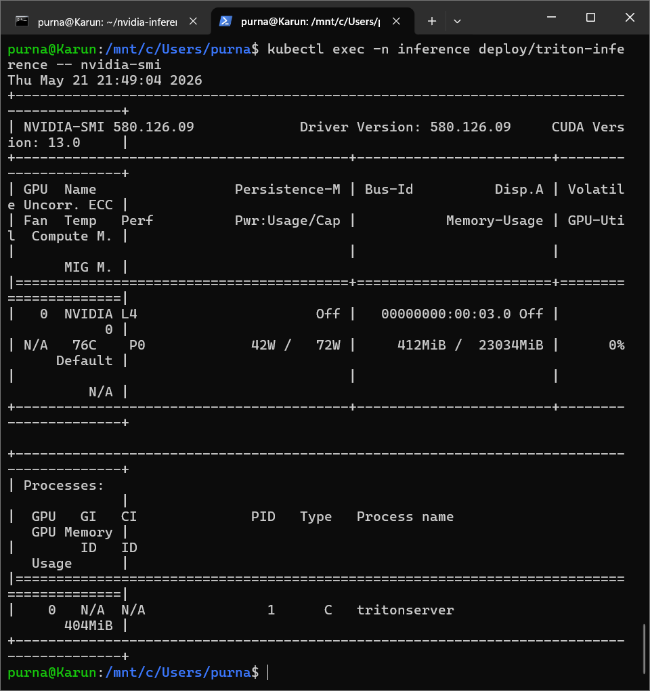

---

## 2. Triton Deployment on Kubernetes

Triton Inference Server deployed as a Kubernetes Deployment with 1/1 pods Ready, zero restarts, serving ResNet50 on the L4 GPU node with GPU resource requests and tolerations for the GPU taint.

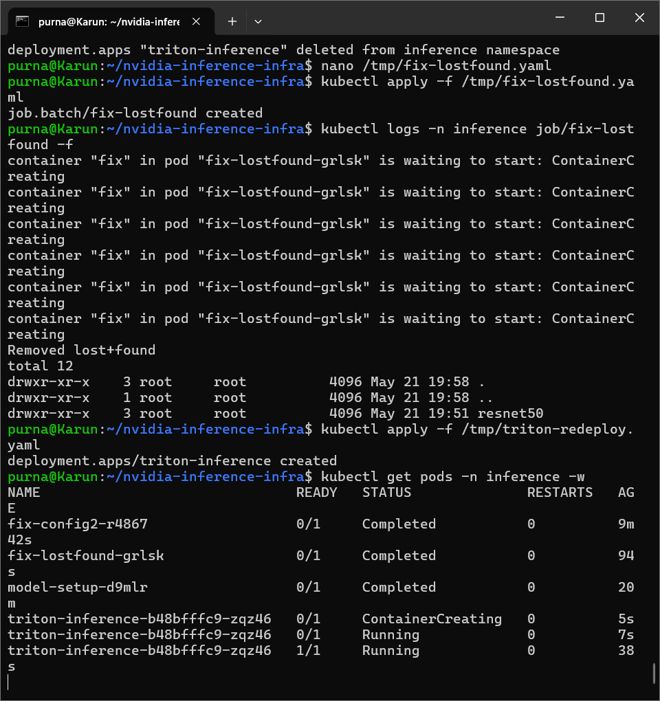

---

## 3. Benchmark Results

### Run 1: 50 Requests, 10 Concurrent

| Metric | Value |
|--------|-------|
| Total Time | 9.22s |
| Successful | 50/50 |
| Errors | 0 |
| Throughput | 5.4 req/s |
| Avg Latency | 386.1ms |
| P50 Latency | 350.4ms |
| P95 Latency | 843.1ms |
| P99 Latency | 889.2ms |
| Min Latency | 32.6ms |
| Max Latency | 889.2ms |

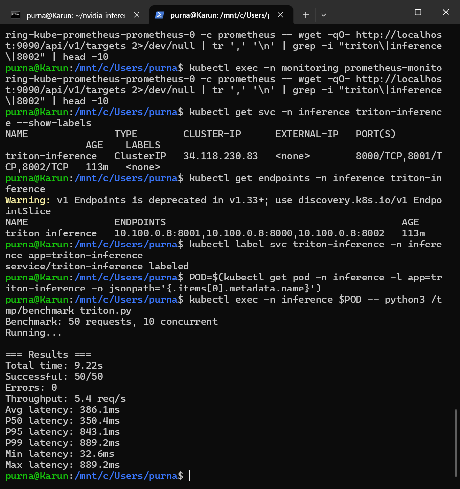

### Run 2: Consistency Verification

| Metric | Value |
|--------|-------|
| Total Time | 9.33s |
| Successful | 50/50 |
| Errors | 0 |
| Throughput | 5.4 req/s |
| Avg Latency | 551.8ms |
| P50 Latency | 486.5ms |
| P95 Latency | 1499.4ms |
| P99 Latency | 1813.1ms |

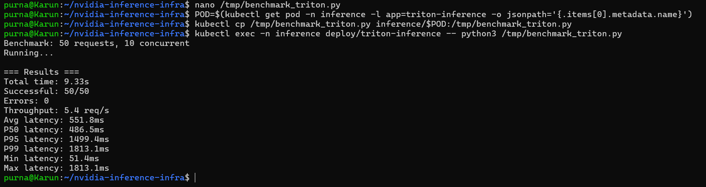

---

## 4. Triton Inference Metrics (Prometheus via Grafana)

Prometheus scraping Triton's /metrics endpoint via ServiceMonitor. 225 successful inference requests with zero failures, model resnet50 v1 on ONNX Runtime backend.

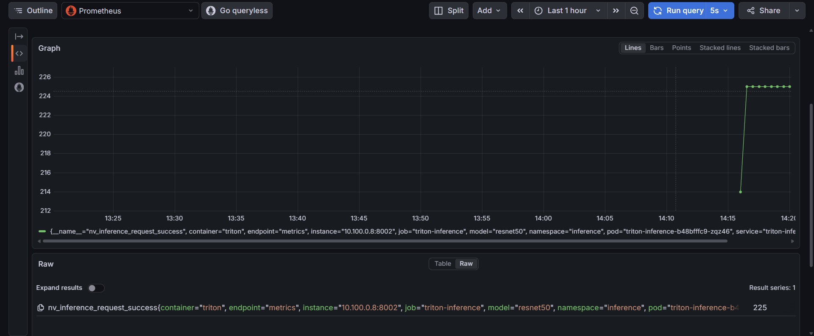

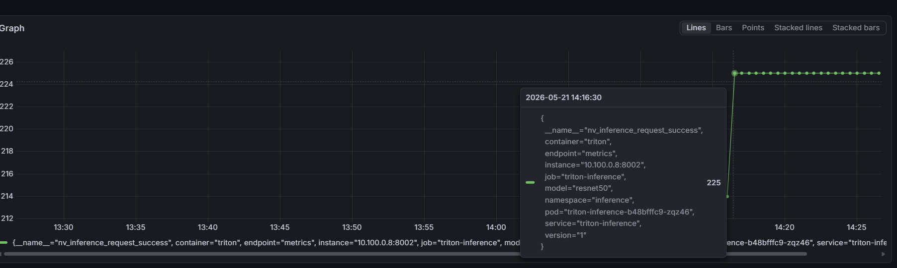

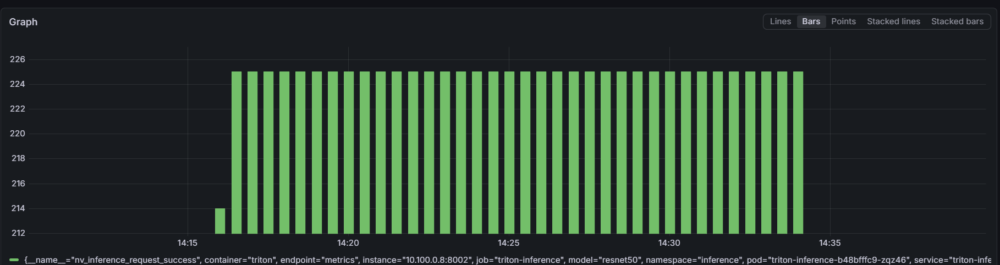

---

## 5. NVIDIA DCGM GPU Metrics (Prometheus via Grafana)

DCGM Exporter deployed as a DaemonSet on the GPU node, collecting hardware-level GPU telemetry and exposing it to Prometheus.

### GPU Temperature (76-77°C)

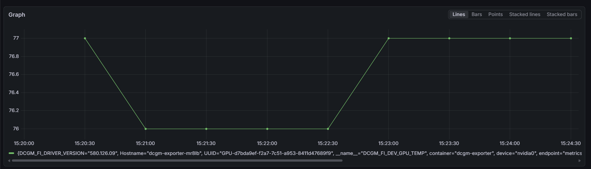

### GPU Utilization

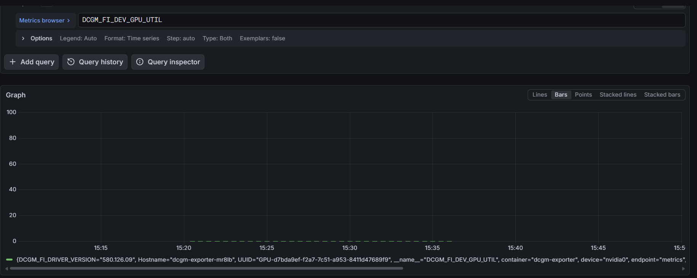

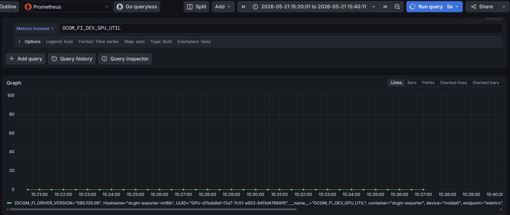

### GPU Power Usage (42.2-42.8W)

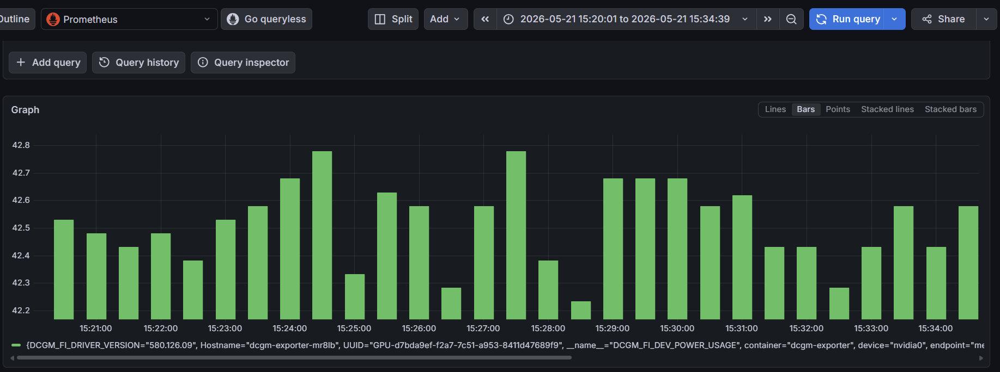

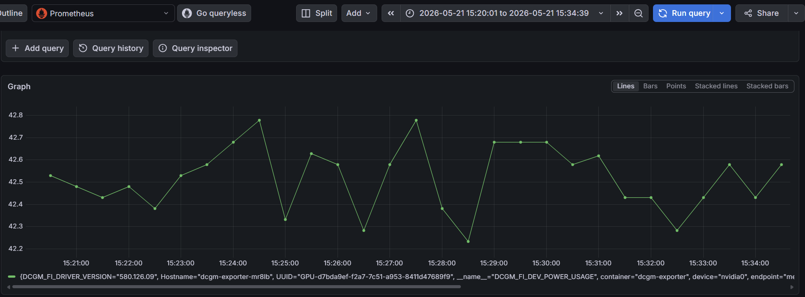

---

## 6. Key DCGM Metrics Summary

| Metric | Value |
|--------|-------|
| GPU Temperature | 76-77°C |
| Power Draw | 42.2-42.8W / 72W TDP |
| SM Clock | 2040 MHz |
| Memory Clock | 6251 MHz |
| GPU Utilization | 0% (idle between benchmarks) |
| Memory Used | 412 MiB / 23034 MiB |

## 7. Triton Prometheus Metrics Summary

| Metric | Value |
|--------|-------|
| nv_inference_request_success | 225+ |
| nv_inference_request_failure | 0 |
| nv_inference_count | 225+ |
| Model | resnet50 v1, ONNX Runtime |
| Dynamic Batching | Enabled |